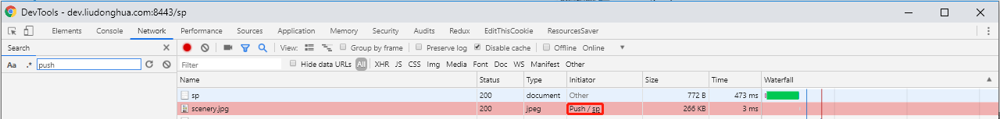
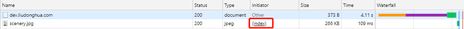

# server-push

This is a simple demo which build on spring-boot 2, provided server-push features.

### How to run

1. git clone https://github.com/liudonghua123/server-push.git
2. cd server-push
3. mvn spring-boot:run

### How to detect server-push works

See the following two pictures, the first is ok (Initiator field start with `Push` keyword), the second is not.





### Import notes

If you are using jdk8, then you should configure `tomcat-native`, see more details on https://docs.spring.io/spring-boot/docs/current/reference/html/howto-embedded-web-servers.html#howto-configure-http2-tomcat. For Windows users, you can pass the opts to java or maven.

1. set opts for java.

   ```
   mvn package

   java -Djava.library.path=D:/apps/tomcat-native-1.2.21-openssl-1.0.2q-win32-bin/bin/x64 -jar target/server-push-0.0.1-SNAPSHOT.jar
   ```

2. set opts for maven.

   I tried set env `MAVEN_OPTS` but not works. Finally, I tried `_JAVA_OPTIONS` according to https://stackoverflow.com/questions/2819853/setting-java-heap-space-under-maven-2-on-windows.

   ```
   set _JAVA_OPTIONS=-Djava.library.path=D:/apps/tomcat-native-1.2.21-openssl-1.0.2q-win32-bin/bin/x64

   mvn spring-boot:run
   ```

The following are steps which I convert a crt and key generated by let's encrypted to jks format (https://stackoverflow.com/questions/38250271/creating-a-jks-from-a-crt-and-key-file-is-that-possible), I also tried using the `PEMCFG` type (https://dentrassi.de/2018/09/25/securing-a-spring-boot-application-with-pkcs-1-pem-files/) keystore, but not works.

1. crt + key -> pfx

   openssl pkcs12 -export -out liudonghua.com.pfx -inkey liudonghua.com.key -in liudonghua.com.crt -password pass:liudonghua

2. pfx -> jks

   keytool -importkeystore -srckeystore liudonghua.com.pfx -srcstoretype pkcs12 -destkeystore liudonghua.com.jks -deststoretype jks -srcalias 1 -srcstorepass liudonghua -deststorepass liudonghua -destalias liudonghua.com

### Some other references

- https://docs.spring.io/spring-boot/docs/current/reference/html/howto-embedded-web-servers.html#howto-configure-http2-tomcat
- https://github.com/spring-projects/spring-framework/wiki/HTTP-2-support
- https://caniuse.com/#feat=http2
- https://www.baeldung.com/spring-5-push
- https://dzone.com/articles/introducing-servlet-40-server-push-using-spring-bo
- https://dzone.com/articles/first-look-at-http2-server-push-in-java-servlet-40-1
- https://medium.com/@crueda/tomcat-native-openssl-in-spring-boot-2-0-a341ad07471d
- https://github.com/craig-rueda/tomcat-native-spring-boot-sample
- https://github.com/making/demo-http2
- https://hoogvliet.de/http2-and-spring-boot
- https://github.com/bclozel/http2-experiments
